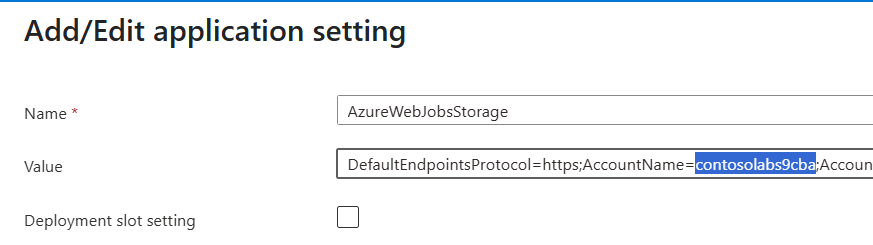

# Custom Code
For this lab we will use custom code to create a CSV file and write the CSV to Azure Storage. Today, Logic Apps doesn't have a native way to create a CSV file although roadmap will in future have CSV support in the Data Mapper. That said, GitHub Co-Pilot is very good at writing code to convert any format to a CSV. The structure we need is as follows (this is a screenshot of a CSV loaded into Excel for clarity):


## Custom Code Overview
Azure Logic Apps provides a rich set of actions, logic and expressions to build integrations. With any low code platform, the out of the box functionality sometimes isn't enough. Azure Functions is a great way to solve these challenges, but requires a separate Azure Functions resource to be created and deployed to Azure with additional cost, overhead and management.

Azure Logic Apps provides the ability to write custom code in C# and Javascript, where the code runs directly within the Logic Apps runtime and therefor doesn't require any additional deployment steps. This also means the call from the Logic App to the Function is a local in process call, and not over HTTP to a different server which may even be in a different data centre of region.

Logic Apps offers two techniques for running custom code:
- Local Function Project - an Azure Functions project is created within the Logic App workspace which has similar characteristics to a traditional Azure Functions Project. For example, intellisense and local debugging are all supported
- In-line code - with this option, C# or JavaScript code is entered directly into the inline code action. There is limited intellisense and no local debugging, so is not suited for more complex scenarios. For simpler scenarios however involving small amounts of code, this can be a great option

## Add Custom Code (Function) to the ContosoFulfilment Logic App


Creating a custom code project can be done in one of two ways:
- Create a Logic App *and* Function project from scratch where both are created
- Add a Function project to an existing Logic Apps project

We will be using option two, adding a Functions project to the *ContosoFulfilment* Logic App. Navigate to the Azure extension, click the Logic Apps icon and select *Create New Project*:


Enter the following as you progress through the wizard:

- template - select *Custom Code Project* 
- target framework - select .NET 8
- folder containing the Logic App project - it should default to the Logic App project already loaded in VS Code
- Function Name - call it CreateCSV
- Namespace - ContosoIntegration

The local Function project is then created in the Logic App workspace as follows:


By default, a sample is created that contains a Weather application. We need to replace the sample with code to convert the order to a CSV. An example C# file to do the conversion is available [here](Code/CreateCSV.cs). Either copy the file and paste into your project (if the filename is the same) or open the file and copy the contents. If you are a competent C# developer, feel free to develop the code yourself, or use GitHub Co-Pilot to help.

## Build the Custom Code Project

To build the custom project, create a new *Terminal* then select the Functions Project in your workspace, for example:

.png>)

Enter the following command to build your project (note, the project name may need to be changed depending on how the project was named):
```powershell
dotnet build .\CreateCSV.csproj
```

If the project builds without errors, the next step is to call the function from our workflow.

## Call Custom Code from the FulfilOrder Workflow 

The FulfilOrder workflow is triggered from a message arriving on a Service Bus topic. To debug our Custom Code, it will make our development slower if we have to trigger the CreateOrder workflow and wait for the entire process to complete.

An easy way to trigger our custom code project is to create a new workflow that is http triggered and call it from the FulfilOrder workflow. This also means the new workflow can be triggered directly via an HTTP call when using the url in the overview page of the workflow.

Create a new workflow called *PublishCSV* by navigating to the Azure extension, then clicking the Logic Apps icon and selecting *Create Workflow* and making the workflow *StateFul*:


The workflow needs to be HTTP triggered, so add a trigger of type *Request - when an HTTP trigger is received*.

We then need to call our custom code function. Add an action, but this time search for *function* and select the *Call a local function in this Logic App* action:


The action should offer a list of Functions - select the *CreateCSV* function as follows:


Name the action "*CSV Function*".

The sample function in the repo accepts a single parameter which is the payload that needs to be converted to CSV. Add the trigger payload as the Function Parameter, i.e., click the lightning symbol, then select the *body* from the HTTP request trigger.

## Response Action

We now need to add a response action to return the response from the custom code. Click + after the call to the custom code action, then for the body, select the output of the custom code action.

## Test and Debug
Test the Custom Code by running the project, then navigating to the overview page of the workflow, copying the callback url and adding it to a new RestClient HTTP file (copy and paste one of the existing RestClient files then update the url). Remember the payload isn't the same as the payload used to trigger the *Contoso_Order* workflow as it has been transformed using the visual mapper. Either view the payload from the Run History, or use [this payload](<../Common Files/sample_request/internalOrderSourceMessage.json>)

A sample RestClient file can be found [here](rest_client/custom_code_workflow.http) but remember to change the url to the url in the overview page of the *PublishCSV* workflow.

The response should be a CSV file as follows:

``` json
OrderId,AccountId,CustomerFullName,ProductId,Quantity,Price,OrderTotal,TotalOrderQuantity,TotalOrderValue
55_1627,4762,Mister Phil Brewster,981,3,20.00,60,4,1460
55_1627,4762,Mister Phil Brewster,649,1,1400.00,1400,4,1460
```
## Debugging

The custom code can also be debugged using the Visual Studio Code debugger. If you are experiencing issues, debugging the code will give great insight to help resolve the problem. Even if the function ran successfully, add a breakpoint and step through the code.

Navigate to the *CreateCSV* C# source file and add a breakpoint by clicking on the left of the code to start the debugging session. See the following for an example of how to do this:


If the breakpoint is hit successfully, there should be a yellow line highlighting the line where the breakpoint was set, for example:


At this point we can step through the remaining lines of code. From the *Run* menu select *Step Over* (or press F10) to execute the current line of code. To continue without debugging press F5 or select *Continue* from the *Run* menu.

## Call the CreateCSV Child Workflow

Although we have created a workflow that executes our custom code, we now need to call it from the FufilOrder workflow and upload the CSV to blob storage.

To call the CreateCSV workflow, click the + icon and select the action called *Call workflow in this logic app* and select the *CreateCSV* workflow from the list of available workflows (there should only be one).

Rename the action to *Call Create CSV Workflow* and set the retry policy to *None*. This makes it easier to debug as it will fail immediately displaying an error, rather than going into a set of retries.

We now need to pass the payload to the workflow. Click *Advanced parameters* and select *Body*, then add the trigger body (i.e., the body from the Service Bus trigger).

To test the workflow, we need to run the FulfilOrder workflow locally, but trigger the *CreateOrder* workflow in Azure to write a message to the Service Bus topic which will trigger the *FulfilOrder* workflow.

## Write to Blob Storage

Finally we need to write the CSV to Azure Blob Storage. For simplicity, we can use the storage account created for the Logic App runtime deployed in Azure.

In Azure, navigate to the storage account used by the *ContosoFulfilment* Logic App (the name can be found in the *AzureWebJobStorage* environment variable of the deployed Logic App which contains the storage account name). Also make a note of the connection string (i.e., the full value of *AzureWebJobStorage*) as this will be required when adding the Blob connector.



Create a new container called *contoso* by navigating to *Data Storage*, then *Containers* and clicking the + Container button at the top of the screen as follows:


Add a new action after the *Call Create CSV Workflow* action using the *built-in Blob Connector*. The action required is called *Upload to blob storage container*. Call it *Upload CSV*.

Add the following settings:

- Container Name - add a forward slash followed by *contoso*
- Blob Name - set to the orderId (select from the *Parse Order Request* action) and append *.CSV*
- Content - set to the content from the service bus trigger (i.e., the request body)
- Advanced Parameters - set *Override if exists* to true

For example:


Test the workflow by running locally then triggering the *Contoso_Order* workflow in Azure.