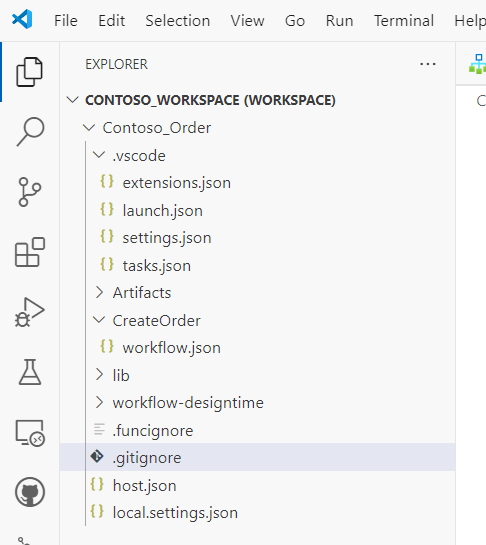

# Create a Logic App in Visual Studio Code

Azure Logic Apps can be created in two different tiers, *Consumption* and *Standard*. Throughout these tutorials, we will be focussing on Logic Apps Standard, which offers the following benefits over Consumption:

- Local development with Visual Studio Code
- Virtual Network support (VNET)
- Private endpoint
- Application Insights
- Flexible scaling
- Flexible hosting
- Separation of infrastructure and business logic
- More than one workflow per Logic App

For more details, please see [this link](https://learn.microsoft.com/en-us/azure/logic-apps/single-tenant-overview-compare)

We will be using Visual Studio Code throughout the Labs.

# Pre-requisites

Ensure the following Visual Studio Code extensions are installed (note: install the Logic Apps (Standard) extension before Azure Functions as it will download dependencies automatically):

- Azure Resources
- Azure CLI Tools
- Azurite
- C#
- C# Dev Kit
- REST Client
- Azure Logic Apps (Standard)
- Azure Functions

For example, to install the REST Client extension, navigate to *Extensions* on the side bar as highlighed below, then search for *Rest Client* and install it:

[This link](https://learn.microsoft.com/en-us/azure/logic-apps/create-standard-workflows-visual-studio-code#tools) provides an excellent walkthrough to get setup with Visual Studio Code, starting with the Azure Logic Apps Extension for Visual Studio Code. Once installed, the extension will download the pre-requisites required. 

Note: In some scenarios, it can take time for the Logic Apps extension to download the dependencies due to local network conditions and therefore may time out. If this happens, update the dependency timeout value to a higher value than the default of 6 minutes. This can be set in the extension settings for Logic Apps as follows:

 Review the [pre-requisites](https://learn.microsoft.com/en-us/azure/logic-apps/create-standard-workflows-visual-studio-code#prerequisites) and [tools](https://learn.microsoft.com/en-us/azure/logic-apps/create-standard-workflows-visual-studio-code#tools) for an understanding of the local environment.

To check if the dependencies have installed correctly, navigate to the following folder:

C:\Users\daphelps\.azurelogicapps\dependencies

Check the following folders exist and have content within them:

- DotNetSDK
- FuncCoreTools
- NodeJs

## Create a Logic App Standard Workspace and Project using Visual Studio Code

For the labs, we recommend creating a folder structure such as C:\Dev\Labs

Logic Apps projects require a Visual Studio Code *Workspace* to be created first. Follow the instructions [here](https://learn.microsoft.com/en-us/azure/logic-apps/create-standard-workflows-visual-studio-code#create-a-local-workspace) to create a workspace - call it *Contoso_Workspace*. Once the workspace is created, follow the prompts to create a Logic App Project and associated Workflow. Name the project *Contoso_Order* and the Workflow *CreateOrder*. When asked if the workflow should be StateFul or Stateless, select *StateFul*.

Once the Workflow is created, an option is displayed to *Enable Connectors in Azure*. Select *Skip for now*.

The workspace, project and workflow should look as follows:

Validate the workflow can be loaded by the visual designer by right clicking *workflow.json* and selecting *Open Designer*. The Logic Apps Visual Designer should be displayed:

Review the local project structure. The project allows for many workflows to be created compared to Consumption Logic Apps which has a limit of one workflow per Logic App. there is also an *Artifacts* folder which contains artifacts such as schemas and maps. There is also a *local.settings.json* file where local configuration can be stored and referenced directly from our workflows.

In the next Lab we will create a trigger and run the Logic App locally.

## .gitignore

A default *.gitignore* file is created in the project which excludes the *.vscode* folder. This is required if checking the project into source control, so can be removed.

