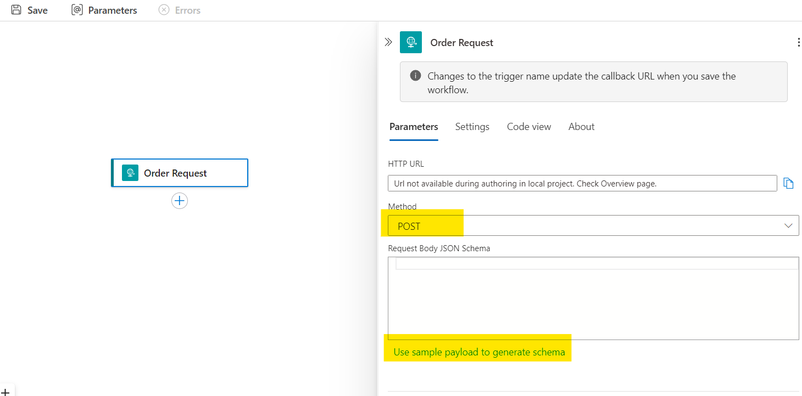

# Create an HTTP Trigger (REST API)

Azure Logic Apps can be triggered from a variety of different data sources and protocols, for example:

- HTTP (POST, PUT, GET etc.)
- Azure Service Bus
- Azure Storage
- Cosmos DB
- FileSystem
- Timer
- SQL

For this Lab we will create a new workflow that exposes a REST API and returns a response payload. We will then run and test locally within Visual Studio Code.

## Create an HTTP Trigger

Ensure the Logic Apps project is loaded, right click *workflow.json* and select *Open Designer*. The Logic Apps Visual Designer should be displayed.

Click *Add a Trigger* and from the triggers listed, select *Request* then *When a HTTP request is received*.

Note: the designer now offers the ability to add frequently used actions and triggers as *favourites* so they are available each time an action or trigger is created. For example:


Rename the trigger from the default to *Order Trigger* and change the *method* to POST. This ensures the trigger will only accept an HTTP POST. Anything else will result in a 404 error being returned to the client.

Note: changing the trigger name will change the trigger url (i.e., the url used to trigger the workflow), so changing the name when deployed will cause a breaking change.

In order for the designer to recognise the fields from our payload in subsequent actions, we need to add a json schema to the request trigger. The easiest way to do this is to click *Use sample payload to generate schema* and paste in the [sample](<../Common Files/sample_request/request.json>). Press *Done* and save the workflow. Note how the schema has been automatically created.



## Test the Workflow
We will now test the workflow, which involves running the project locally and testing with the *REST Client* Visual Studio Code extension.

### Run the Workflow Locally
From the VS Code menu, select *Run* then *Run Without Debugging*. This will start the runtime and create a running instance of your Logic App. You should see the *Azurite* storage emulator start,which emulates the Azure Storage account the Logic App requires to store running state. Be aware of any errors that may appear in red in the output window.

We now need to view the local url to call the workflow. Navigate to the *workflow.json* file, right click and select *Overview*: where the trigger url should be displayed:


From the screen displayed next, copy the *Callback url* (note it has to be highlighted first before copying):


### Test from REST Client
There are avariety of tools we can use to test the API including Postman (https://www.postman.com/downloads/) or Hopscotch (https://hoppscotch.io), but we will be using *REST Client*, a convenient and simple to use Visual Studio Code extension.

*REST Client* should have been installed as part of the pre-requisite extensions. If not, refer to  [this section](<../Lab_1_LogicApp Setup/1.1 Create_LogicApp (Standard).md>). More details on how to use *REST Client* can be found [here](https://github.com/Huachao/vscode-restclient)

A sample *REST Client* test file is provided [here](rest_client/http_trigger.http). Edit the file and paste the *Callback url* copied earlier over the top of the url in the file. *Send Request* should be visible immediately above the url - click it to trigger the workflow (or right click and select *Send Request*). If *Send Request* isn't visible, verify *REST Client* is installed correctly. It should look as follows:

  

The response should be a *202 Accepted* because the workflow receives a request but doesn't return a response yet (i.e., it is *asynchronous*). This is a common pattern in Logic apps where the workflow is triggered by an HTTP request which returns a 202 immediately, but the workflow continues running in the background.

### Add a Response

To return a response from the workflow we need to add a *Response* action. Open the workflow designer, and click "+" to add an action. Select *Request* then *Response*.

Add a header called *Content-Type* and a value of *application/json*

We also want the response payload to return a *status*, *orderId* and *timestamp*.

Copy the following json and paste into the response body:
```json
{
  "status": "received",
  "timestamp": "@utcNow()"
}
```
Note the *utcNow()* function - this is a built-in Logic Apps expression to return the current date and time in Co-ordinated Universal Time (UTC) format. A full list of Logic Apps expressions can be found [here](https://learn.microsoft.com/en-us/azure/logic-apps/workflow-definition-language-functions-reference). For example, there are functions to concatenate and search strings, perform maths operations, logical operations, conversions etc.

Run the workflow again and notice the 200 OK response and the payload is returned.

We haven't however returned the *orderId* from the request. To do this, we can use the visual aspect of the designer to select the orderId from the request. This is because we added a schema to the request - this is what gives the designer the insight of the fields in the request. Open the Response action and add "orderId" as a field, but for the value, click the lightning bolt and navigate to the and select *orderId*:


 Once selected, it should look as follows:


Save the workflow. Note: the visual designer saves the workflow as a json. The json can be viewed by either selecting the file in the folder structure or selecting *Code View* to see the code for just the response action:


Run the workflow again and a response similar to the following should be returned:

```json
{
  "orderId": "55_1626",
  "status": "received",
  "timestamp": "2025-04-07T23:12:59.0406266Z"
}
```
In a future lab will will use the Logic Apps Visual Mapper to create a new payload which doesn't require typing json directly into the action.

### Enable Schema Validation

Although we've specified a schema for the HTTP trigger, it currently allows any json payload to be received. We can apply schema validation to ensure the request conforms to the schema definition. Select the *Order Request* trigger then go to *Settings* and enable *Schema Validation* as follows:


Make *orderId* a mandatory field and update the request trigger to include the updated schema. The schema [here](<../Common Files/schemas/request.json>) includes orderId as a mandatory field for your reference.

Test the workflow again, but this time remove the orderId field from the request. An error should be returned indicating the request does not match the schema.

### View Local Run History
Each time a workflow is activated by a trigger, a visual representation of the workflow execution is available in *Run History*. Navigate to the *Overview* page for the workflow (right click workflow.json) and click *Refresh*. The run should be visible, with the trigger visible with a green tick indicating success (a red cross indicates a failure). Click the trigger and view the payload details and the response to see the response payload:


As we add more actions and logic to our workflow, these will also be visible in the run history. When the Logic App is deployed to Azure, the run history is stored within an Azure Storage Account. Locally however, the Logic App uses a storage emulator called *Azurite* which should have been downloaded automatically when the Logic Apps extension was installed. Note the following setting in *local.settings.json* which tells the Logic App to use a storage emulator:

``` C#
"AzureWebJobsStorage": "UseDevelopmentStorage=true",
```


