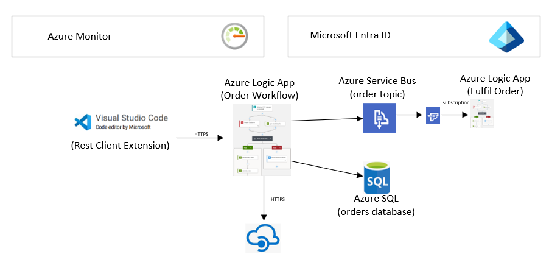

# Azure Logic Apps – Training Focus Areas

Over the course of 2 days, build a fictitious business process for processing customer orders. The actual plan can be flexible, but is a starting point:

We will be building a solution based on the following architecture:

## Areas Covered

### Logic Apps Standard
- Visual Studio Code development
- Setup local environment
- Create Workflows with connectors and conditional logic
- Understand and create error handlers
- Test Workflows, view run history
- Configure application settings
- Configure Security

### Connectors
- Write to Azure Service Bus Topic
- Subscribe to Azure Service Bus Topic
- Call HTTP REST API
- Call SQL Database
- Hosting – create and understand Logic Apps Standard Plan, settings and scaling
- Monitoring - Application Insights configuration, log custom fields using tracked properties

### Azure Portal
- Create Logic App and Plan
- Create workflows
- Test Workflows, view run history

### Service Bus
- Configure Topics and subscriptions
- Configure RBAC security at namespace and queue/topic levels
- Private Networking
- Deployment – how to deploy using Azure DevOps

